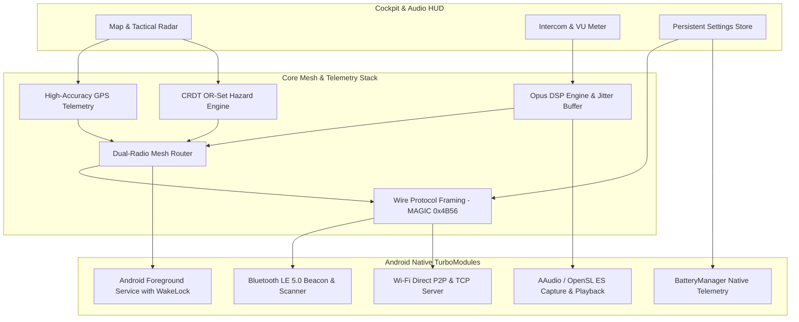

# Konvoy 🏍️
### Zero-Infrastructure Off-Grid Motorcycle Convoy Intercom & Tactical Mesh Map

[-purple.svg)](https://reactnative.dev/docs/new-architecture-intro)

**Konvoy** is an off-grid, peer-to-peer motorcycle communications and navigation app designed for group rides in remote mountain passes, desert trails, and areas with zero cellular reception.

Unlike proprietary motorcycle intercom headsets (Sena, Cardo) that cost hundreds of dollars and lock riders into brand silos, Konvoy turns standard smartphones and existing Bluetooth helmet headsets into an encrypted, multi-hop mesh intercom with synchronized real-time radar mapping and crowd-sourced hazard alerts.

---

## Key Features

### 🎙️ Direct Rider-to-Rider Voice Intercom
- **No Cellular or Wi-Fi Router Required**: Communicates bike-to-bike directly using peer-to-peer Wi-Fi Direct and Bluetooth Low Energy (BLE).
- **Nostr Internet Bridge**: Automatically forwards and syncs all mesh communications over public Nostr relays globally with AES-256-GCM encryption when cellular connectivity is available.
- **Push-to-Talk & Hands-Free (VOX)**:
  - **Hold to Talk**: Traditional PTT for glove-friendly momentary transmission.
  - **Tap to Talk / VOX**: Tap once to talk hands-free; voice activity detection (VAD) automatically suppresses exhaust roar and wind howl.
- **Opus Wideband Audio**: 16kHz libopus pipeline with adaptive jitter buffer and acoustic echo cancellation.
- **Bluetooth & Handlebar Remotes**: Maps to handlebar-mounted Bluetooth media buttons and headset action buttons with distinct haptic confirmation.

### 🗺️ Live Group Map & Tactical Radar
- **Direct Google Maps Reference**: Official Google Maps road tiles, high-contrast hybrid satellite view, and topographic terrain contours.
- **Zero White/Blank Screens**: Uses fast global raster tile layers with seamless fallback; no missing font glyphs or vector parser stalls.
- **Cockpit HUD & Tactical Radar View**:
  - Live speedometer, heading compass, and altitude display.
  - Switch between Cartographic Google Map and 100m Tactical Radar display showing relative positions of fellow riders.
- **Live Ride Tracking**: Real-time GPS location broadcasting with zero mock data.

### ⚠️ Instant Road Hazard Alerts (CRDT Synchronized)
- **One-Tap Reporting**: Report police speed traps, crashes, oil slicks / road debris, and traffic bottlenecks in a split second with gloved fingers.
- **Conflict-Free Replication (CRDT OR-Set)**: Hazard pins are gossiped bike-to-bike over the mesh. Every rider's map converges without a central server.
- **Auto-Expiring Pins**: Hazards automatically time out (TTL) or can be cleared by group consensus when the road is clear.

### 🔒 Zero-Knowledge & Air-Gapped Privacy
- **No Phone Numbers, No Accounts, No Emails**: Generates ephemeral Ed25519 signing keys and X25519 ECDH encryption keys locally per session.
- **Burn Identity**: Instantly purge cryptographic identity and generate a fresh public fingerprint with one tap.
- **Persistent Local Settings**: Configured via encrypted MMKV storage — your PTT mode, noise gate, radio preferences, and map choices stay intact across rides.

---

## App Screens

| 🗺️ Map Screen | 🎙️ Intercom Screen | ⚙️ Settings Screen |
| :---: | :---: | :---: |
| Cockpit HUD, Google Maps / Satellite / Dark toggle, live rider markers & hazard pins | Massive glove-friendly PTT button, Hands-Free VOX toggle, real-time VU meter & rider roster | Ephemeral key rotation, noise gate, Opus bitrate (8/12/16 kbps) & Bluetooth remote pairing |

---

## System Architecture

---

## Technology Stack

- **Framework**: React Native 0.87+ (New Architecture with Fabric & TurboModules)
- **Language**: TypeScript 6.0+ & Kotlin
- **State Management**: Zustand with encrypted MMKV persistence (`react-native-mmkv`)
- **Cartography**: MapLibre Native (`@maplibre/maplibre-react-native`) with Google Maps raster tile integration
- **Cryptography**: `@noble/curves` (Ed25519, X25519) and `@noble/hashes` (BLAKE3)
- **Audio Pipeline**: libopus 16kHz wideband, adaptive jitter buffer (40–100ms), software VAD & noise gate
- **Hardware Integration**: BLE HID remote listeners (`react-native-haptic-feedback`, `android.os.BatteryManager`)

---

## Quick Navigation

- 🚀 [**Quickstart Guide**](docs/QUICKSTART.md) — Step-by-step instructions for downloading, installing, and running Konvoy.
- 📐 [**Implementation Guide**](docs/IMPLEMENTATION_GUIDE.md) — Deep technical specification of the wire protocol, CRDT engine, and audio DSP pipeline.
- 🧪 [**Test Suite**](__tests__/) — Run the 67 automated Jest unit tests covering CRDT, bloom filters, wire framing, and settings persistence.

---

## License

Konvoy is open-source software released under the [MIT License](LICENSE).
